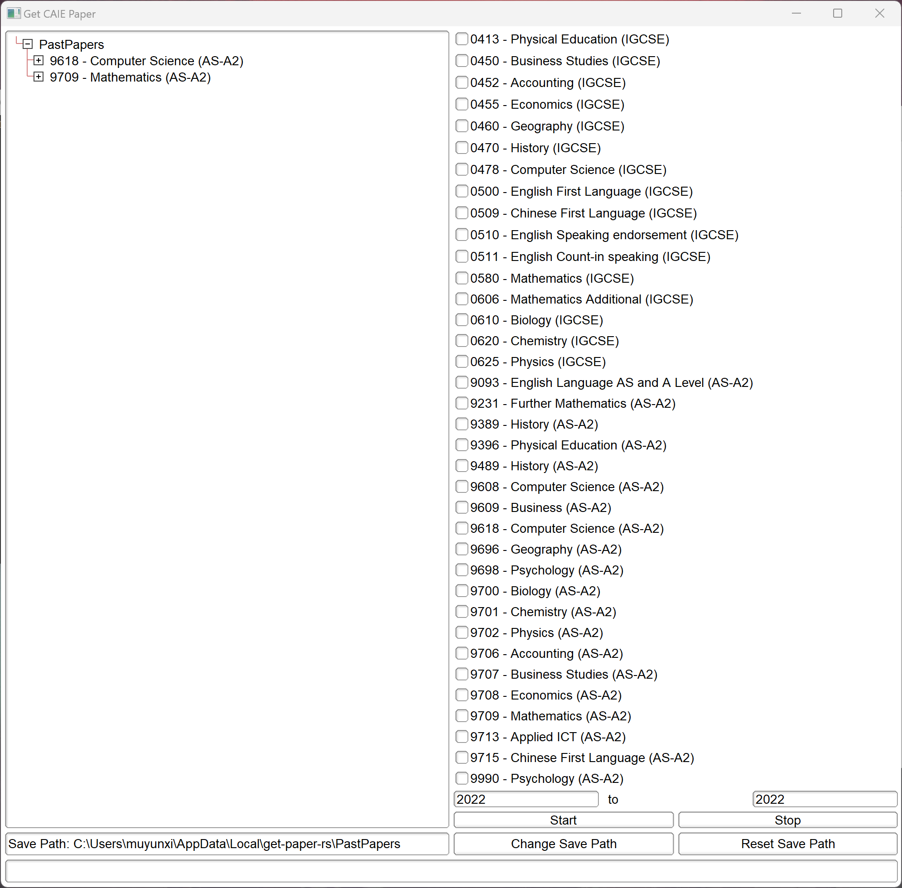
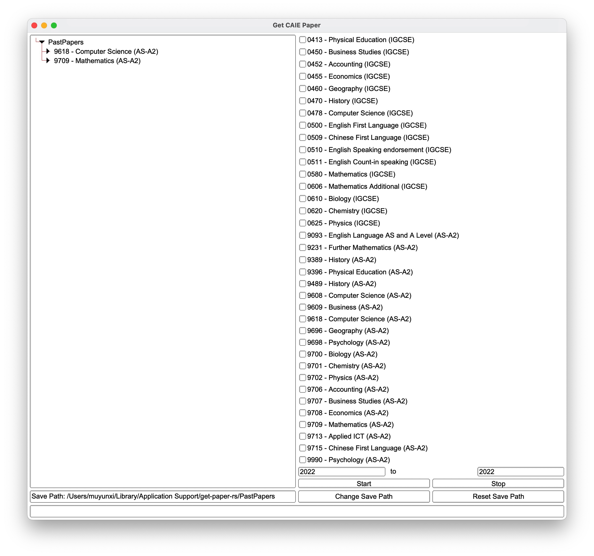

# Get Paper - rust
***An application to download CAIE past papers.***

## Preview
| Windows 11 | MacOS |
| ---------- | ----- |
|  |  |

## Platform
* Support **MacOS** & **Windows** now.
* Most codes are also capable with linux and other system. You can build a version by yourself on other platforms.

## Rust
### Rust Version:
* MacOS: *1.69.0* stable-aarch64-apple-darwin
* Windows: *1.70.0* stable-x86_64-pc-windows-msvc

## Thanks for following websites and rust crates
1. All past papers are from [cie.fraft.cn](https://cie.fraft.cn)
2. GUI crate: [fltk-rs](https://github.com/fltk-rs/fltk-rs)
3. Other crates are also listed in [Cargo.toml](./Cargo.toml)
